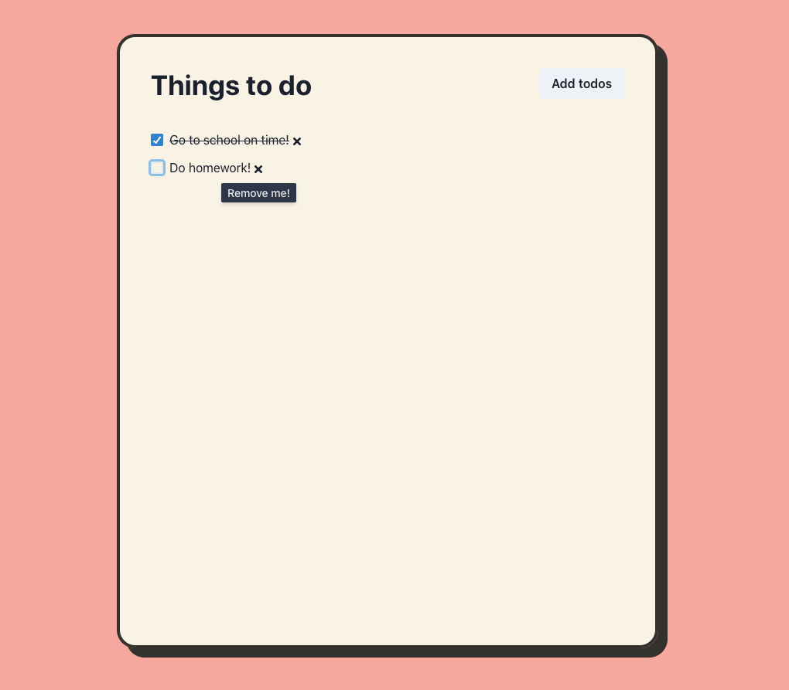

This project was bootstrapped with [Create React App](https://github.com/facebook/create-react-app).

## Quick description

This is my project for practicing:
- ReactJS
- Redux
- TypeScript
- Chakra UI

It has very basic basic features:
- List todo items, including planned and finished ones
- Create a new todo item
- Remove todo item

I hope you guys enjoy checking this repo.

## Start

Run the following commands. You gonna need nodejs preinstalled.

```shell
  yarn install
  yarn start
```

## Design



This project design is from [this awesome design](https://www.figma.com/community/file/873811480190908553).
